---
## Author
author:
  name: Стрижов Дмитрий Павлович
  degrees: student
  orcid: 0000-0002-0877-7063
  email: 1132236054@rudn.ru
  affiliation:
    - name: Российский университет дружбы народов
      country: Российская Федерация
      postal-code: 117198
      city: Москва
      address: ул. Миклухо-Маклая, д. 6
      
## Title
title: "Отчет по лабораторной работе №2"
subtitle: "Имитационное моделирование"
license: CC BY
date: today
date-format: "2026-10-07" # Example: 2025-09-06
---

# Информация

## Докладчик

:::::::::::::: {.columns align=center}
::: {.column width="70%"}

  * Стрижов Дмитрий Павлович
  * студент Факультета физико-математических и естественных наук
  * Российский университет дружбы народов им. П. Лумумбы
  * [1132236054@rudn.ru](mailto:1132236054@rudn.ru)

:::
::: {.column width="30%"}

:::
::::::::::::::
# Вводная часть
## Цель работы

Цель данной лабораторной работы — изучить основные модели SIR и Лотки–Вольтерры, а так же изучить аспекты их программной реализации.

# # Задание

- Создать рабочий каталог для всего курса.
- Создать рабочее пространство для программ в рамках лабораторной работы.
- Выполнить все задания по тексту лабораторной работы.
- Установить необходимые пакеты.
- Выполнить предложенный код.
- Преобразовать код в литературный стиль.
- Сгенерировать из литературного кода:
	- чистый код;
	- jupyter notebook;
	- документацию в формате Quarto.
	- Выполнить код из jupyter notebook.
- Интегрировать документацию в формате Quarto в отчёт.
- Добавить в код в литературном стиле вычисление для набора параметров.
- Сгенерировать из литературного кода с параметрами:
	- чистый код;
	- jupyter notebook;
	- документацию в формате Quarto.
	- Выполнить код из jupyter notebook с параметрами.
- Интегрировать документацию с параметрами в формате Quarto в отчёт.

# Теоретическое введение

## Модель SIR

Модель SIR есть классическая и фундаментальная математическая модель эпидемиологии, описывающая распространение инфекционного заболевания в закрытой популяции.

## Базовая модель

Модель SIR делит всю популяцию на три взаимосвязанные группы (компартменты), что отражено в её названии:

S — Susceptible (Восприимчивые): люди, которые не болели, не имеют иммунитета и могут заразиться.
I — Infectious (Инфицированные/Заразные): люди, которые в данный момент больны и могут передавать инфекцию.
R — Recovered (Выздоровевшие/Удаленные): люди, которые переболели и приобрели иммунитет (или умерли). Они больше не участвуют в процессе передачи.

Основная цель модели: не предсказать судьбу конкретного человека, а понять общую динамику эпидемии — будет ли она разрастаться, как быстро, сколько людей в итоге переболеет, как влияют карантинные меры.

## Трёхпараметрическая модель SIR

В классической двухпараметрической модели (β, γ) параметр β (коэффициент заражения) является составным. Он скрывает в себе два процесса:

- Контакт между людьми (поведенческий, управляемый фактор).
- Передачу инфекции при контакте (биологический фактор).

## Трёхпараметрическая модель SIR

Трёхпараметрическая модель делает это разделение явным:

- c — среднее число контактов (достаточно тесных для передачи инфекции) одного человека в единицу времени.
- β — вероятность передачи инфекции при одном контакте между заразным и восприимчивым (безразмерная величина, от 0 до 1).
- γ — скорость выздоровления (доля инфицированных, выздоравливающих в единицу времени). Как и раньше, 1/γ — средняя продолжительность заразного периода.
Итоговый параметр силы заражения теперь выражается как произведение:  c * β.

## Модель Лотки–Вольтерры

Модель Лотки-Вольтерры — это фундаментальная математическая модель в экологии, описывающая динамику взаимодействия двух видов: хищников и жертв. Она была независимо предложена в 1920-х годах:

- Альфредом Лоткой (1925) для химических реакций.
- Витторио Вольтеррой (1926) для объяснения колебаний улова рыбы в Адриатическом море.

Модель демонстрирует, как даже простая система взаимодействий может порождать сложные колебательные режимы, объясняя циклические изменения численности в природных экосистемах.

# Выполнение лабораторной работы

## Подготовка проекта

Инициализируем проект ([рис. @fig-001]).

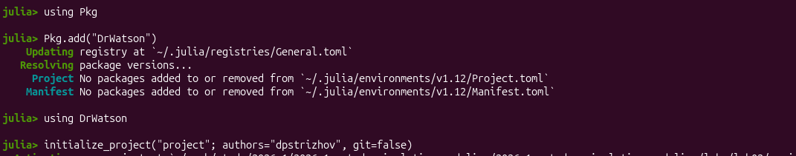{#fig-001 width=70%}

## Подготовка проекта

Убеждаемся, что шаблон проекта создан верно ([рис. @fig-002]).

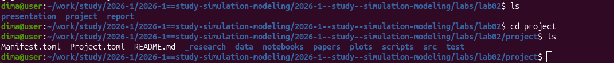{#fig-002 width=70%}

## Подготовка проекта

Устанавливаем все необходимые пакеты ([рис. @fig-003]).

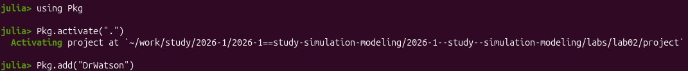{#fig-003 width=70%}

## Подготовка проекта

Устанавливаем все необходимые пакеты ([рис. @fig-003]).

{#fig-003 width=70%}

## Подготовка проекта

Убеждаемся, что все пакеты установлены ([рис. @fig-004]).

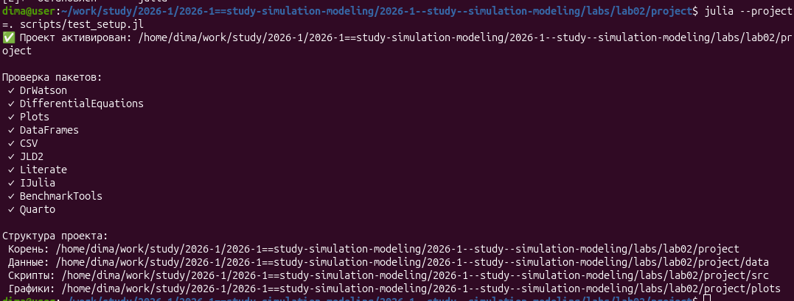{#fig-004 width=70%}

# Основные модели

## Модель SIR

Создаём файл scripts/sir_ode.jl с реализацией модели ([рис. @fig-005]).

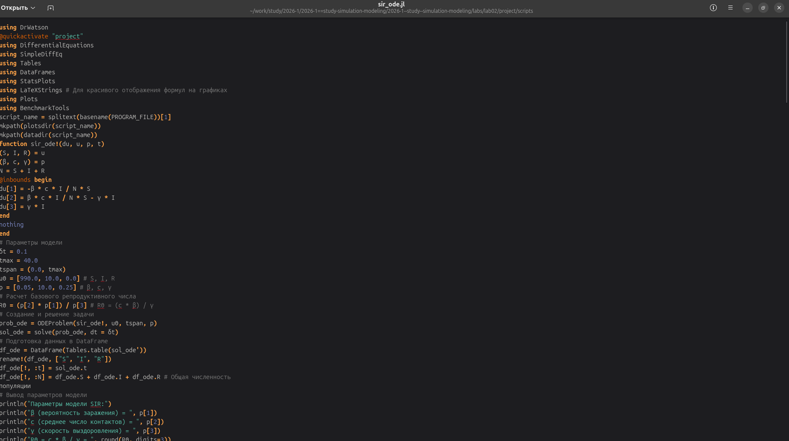{#fig-005 width=70%}

## Модель SIR

Запускаем скрипт ([рис. @fig-006]).

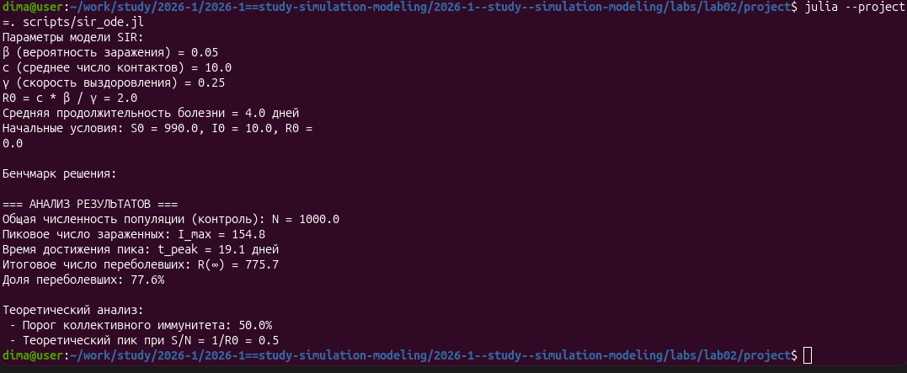{#fig-006 width=70%}

## Модель SIR

Создаем производные файлы ([рис. @fig-007]).

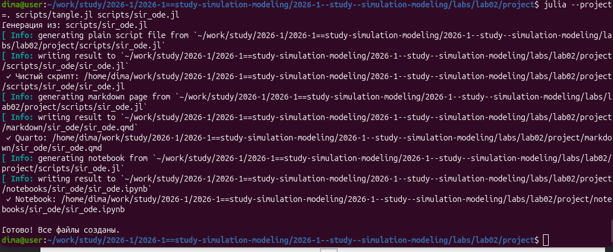{#fig-007 width=70%}

## Модель SIR

Выполняем скрипт в jupyter notebook ([рис. @fig-008]).

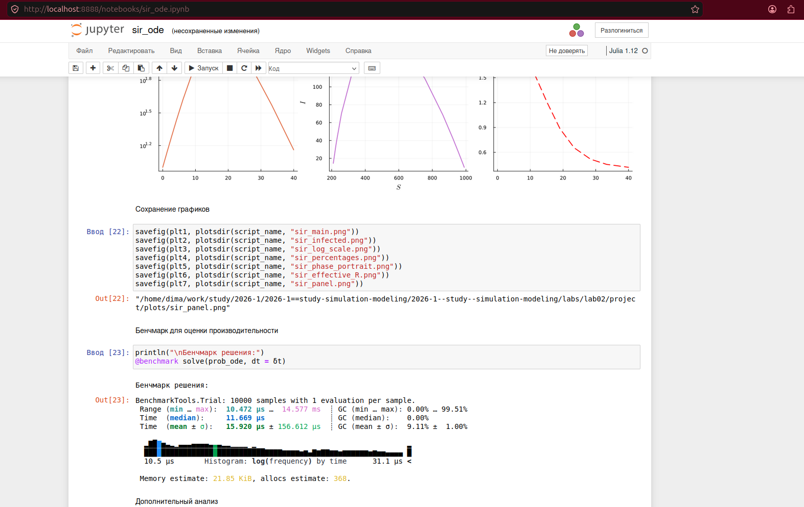{#fig-008 width=70%}

## Модель SIR

Добавляем скрипт в отчет ([рис. @fig-009]).

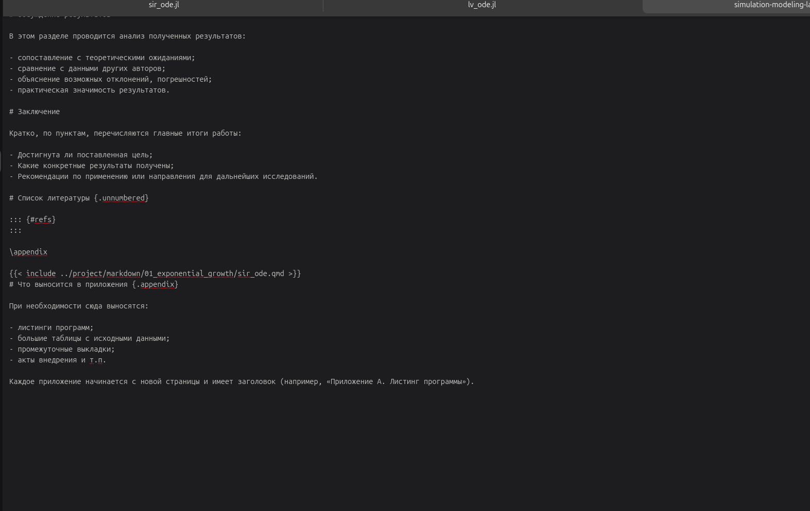{#fig-009 width=70%}

## Модель Лотки–Вольтерры

Создаём файл scripts/lv_ode.jl с реализацией модели ([рис. @fig-010]).

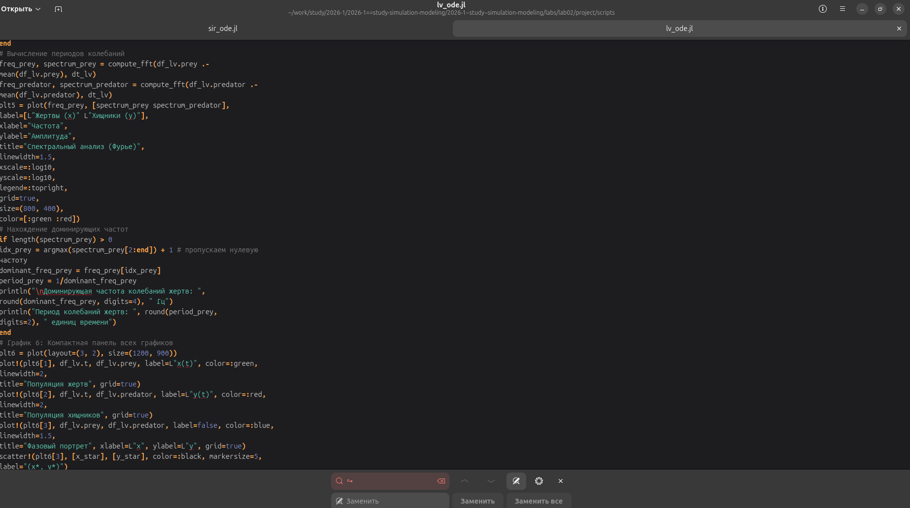{#fig-010 width=70%}

## Модель Лотки–Вольтерры

Запускаем скрипт ([рис. @fig-011]).

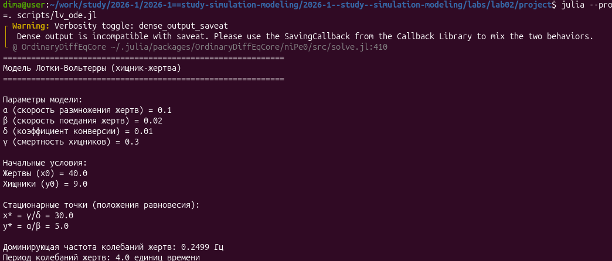{#fig-011 width=70%}

## Модель Лотки–Вольтерры

Создаем производные файлы ([рис. @fig-012]).

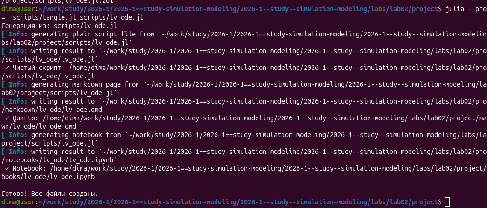{#fig-012 width=70%}

## Модель Лотки–Вольтерры

Выполняем скрипт в jupyter notebook ([рис. @fig-013]).

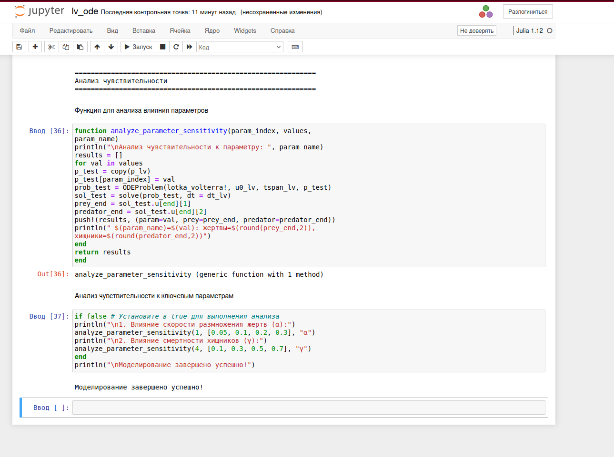{#fig-013 width=70%}

## Модель Лотки–Вольтерры

Добавляем скрипт в отчет ([рис. @fig-014]).

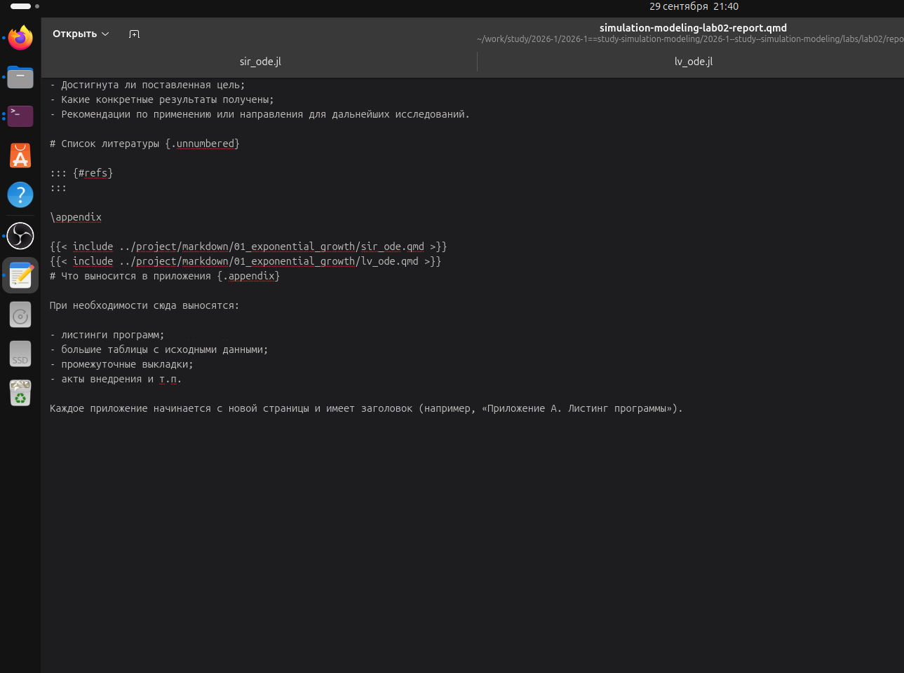{#fig-014 width=70%}

# Выводы

В ходе данной лабораторной работы мной были изучены основные модели SIR и Лотки–Вольтерры, а так же аспекты их программной реализации.

# Список литературы

1. Kermack W.O., McKendrick A.G. A Contribution to the Mathematical Theory of Epidemics // Proceedings of the Royal Society of London. Series A, Containing Papers of a Mathematical and Physical Character. The Royal Society, 1927. Т. 115, № 772. С. 700–721.

2. Hethcote H.W. The Mathematics of Infectious Diseases // SIAM Review. Society for Industrial & Applied Mathematics (SIAM), 2000. Т. 42, № 4. С. 599–653.

3. Lotka A.J. Elements of Physical Biology. Baltimore: Williams; Wilkins Company, 1925. 435 с.

4. Lotka A.J. Contribution to the Theory of Periodic Reaction // The Journal of Physical Chemistry A. 1910. Т. 14, № 3. С. 271–274.

5. Volterra V. Variations and fluctuations of the number of individuals in animal species living together // Journal du Conseil permanent International pour l’ Exploration de la Mer. 1928. Т. 3, № 1. С. 3–51.

6. Вольтерра B. Математическая теория борьбы за существование. Москва: Наука, 1976. 288 с.
