---
## Author
author:
  name: Стрижов Дмитрий Павлович
  email: 1132236054@rudn.ru
  affiliation:
    - name: Российский университет дружбы народов
      country: Российская Федерация
      postal-code: 117198
      city: Москва
      address: ул. Миклухо-Маклая, д. 6

## Title
title: "Отчёт по лабораторной работе №6"
subtitle: "Имитационное моделирование"
license: "CC BY"
---

# Задание

- Создать рабочий каталог для всего курса.
- Создать рабочее пространство для программ в рамках лабораторной работы.
- Выполнить все задания по тексту лабораторной работы.
- Установить необходимые пакеты.
- Выполнить предложенный код.
- Преобразовать код в литературный стиль.
- Сгенерировать из литературного кода:
	- чистый код;
	- jupyter notebook;
	- документацию в формате Quarto.
	- Выполнить код из jupyter notebook.
- Интегрировать документацию в формате Quarto в отчёт.
- Добавить в код в литературном стиле вычисление для набора параметров.
- Сгенерировать из литературного кода с параметрами:
	- чистый код;
	- jupyter notebook;
	- документацию в формате Quarto.
- Выполнить код из jupyter notebook с параметрами.
- Интегрировать документацию с параметрами в формате Quarto в отчёт.

# Теоретическое введение

### Модель SIR

Модель SIR есть классическая и фундаментальная математическая модель эпидемиологии, описывающая распространение инфекционного заболевания в закрытой популяции.

#### Базовая модель

Модель SIR делит всю популяцию на три взаимосвязанные группы (компартменты), что отражено в её названии:

S — Susceptible (Восприимчивые): люди, которые не болели, не имеют иммунитета и могут заразиться.
I — Infectious (Инфицированные/Заразные): люди, которые в данный момент больны и могут передавать инфекцию.
R — Recovered (Выздоровевшие/Удаленные): люди, которые переболели и приобрели иммунитет (или умерли). Они больше не участвуют в процессе передачи.

Основная цель модели: не предсказать судьбу конкретного человека, а понять общую динамику эпидемии — будет ли она разрастаться, как быстро, сколько людей в итоге переболеет, как влияют карантинные меры.

#### Трёхпараметрическая модель SIR

В классической двухпараметрической модели (β, γ) параметр β (коэффициент заражения) является составным. Он скрывает в себе два процесса:

- Контакт между людьми (поведенческий, управляемый фактор).
- Передачу инфекции при контакте (биологический фактор).

Трёхпараметрическая модель делает это разделение явным:

- c — среднее число контактов (достаточно тесных для передачи инфекции) одного человека в единицу времени.
- β — вероятность передачи инфекции при одном контакте между заразным и восприимчивым (безразмерная величина, от 0 до 1).
- γ — скорость выздоровления (доля инфицированных, выздоравливающих в единицу времени). Как и раньше, 1/γ — средняя продолжительность заразного периода.
Итоговый параметр силы заражения теперь выражается как произведение:  c * β.

# Цель работы

Целью данной лабораторной работы является реализация модели эпидемии SIR с использованием сетей Петри и анализ результата действия данной модели.

# Выполнение лабораторной работы

## Инициализация проекта

Инициализируем проект, проверяем наличие всех пакетов ([рис. @fig-001]).

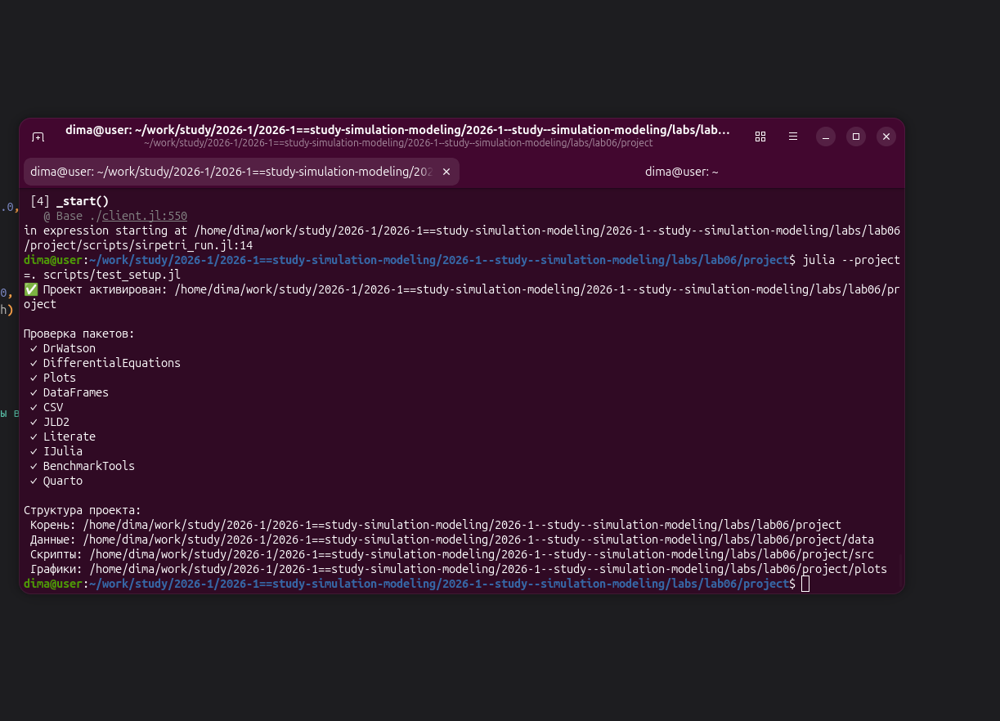{#fig-001 width=70%}

## Основная программа

— Файл: src/SIRPetri.jl ([рис. @fig-002]).
— Реализует вычислительную логику модели.

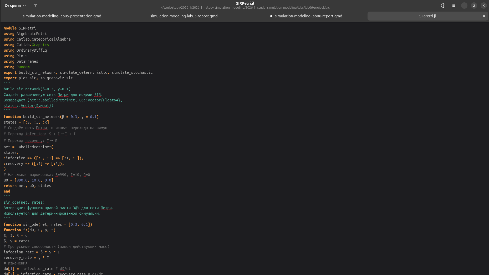{#fig-002 width=70%}

## Базовый прогон модели

Создаем скрипт scripts/sirpetri_run.jl, запускаем его и создаем производные файлы. ([рис. @fig-003]).

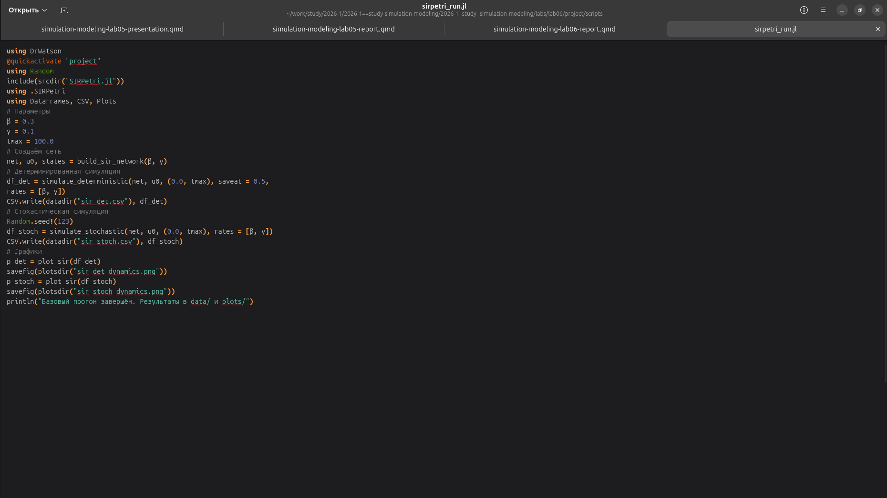{#fig-003 width=70%}

Этот скрипт: 
— Выполняет один базовый эксперимент с фиксированными параметрами β = 0.3, γ = 0.1.
— Запускает два типа симуляции:
— детерминированную (решение ОДУ) — даёт плавную усреднённую динамику;
— стохастическую (алгоритм Гиллеспи) — учитывает случайные флуктуации.
— Сохраняет результаты в CSV‑файлы и строит графики S(t), I(t), R(t) для обоих типов.



Запускаем скрипт и создаем производные файлы. ([рис. @fig-004]).

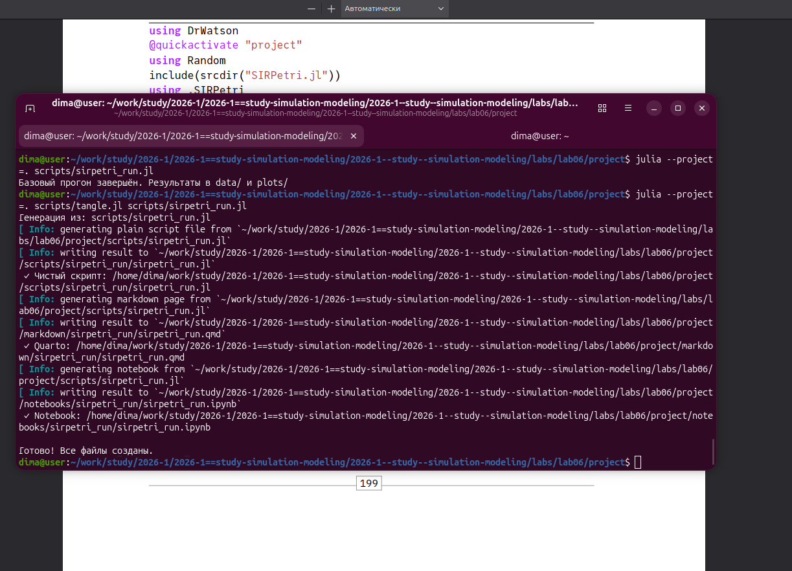{#fig-004 width=70%}

Запускаем скрипт в jupyter notebook. ([рис. @fig-005]).

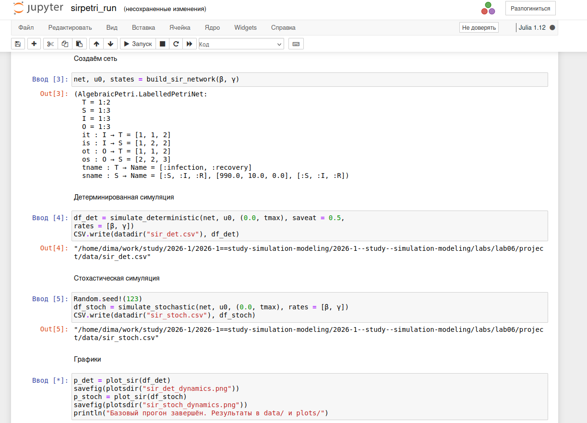{#fig-005 width=70%}

Вот результирующие графики:

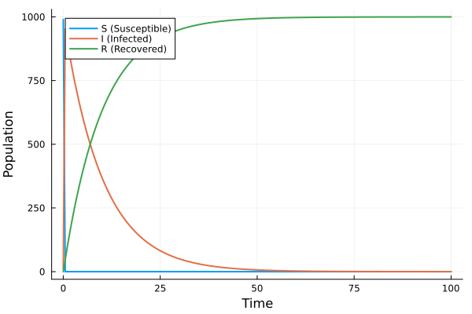{ width=70%}

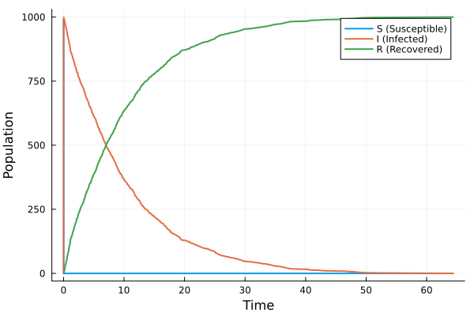{ width=70%}

Детерминированный график показывает классический пик эпидемии: рост I, максимум, затем спад до нуля; R растёт и выходит на плато, S падает.
Стохастический график может иметь шумы и, возможно, немного отличаться по времени пика и амплитуде – это демонстрирует влияние случайности.
Сравнение двух типов симуляции показывает, что при большом начальном числе восприимчивых (990) стохастическая траектория близка к детерминированной, но при малых числах различия были бы значительны.

## Коэффициент заражения β

Создаем скрипт scripts/sirpetri_scan_parameters.jl ([рис. @fig-006]).

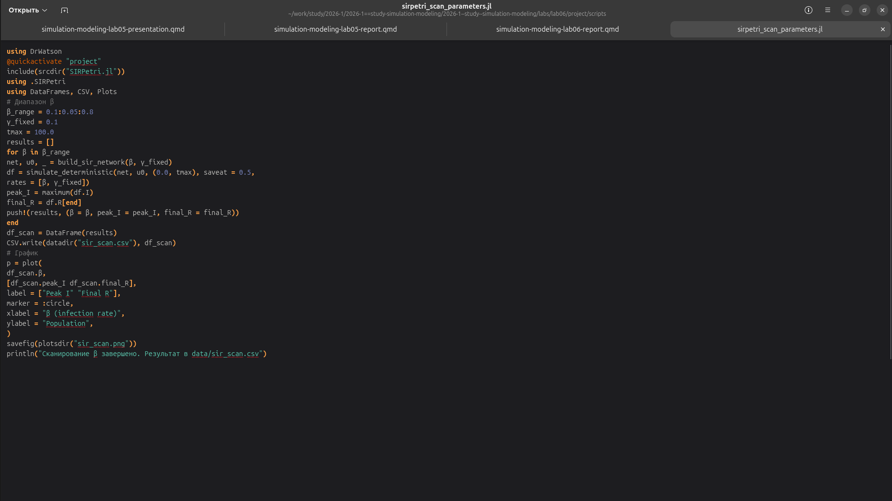{#fig-006 width=70%}

Этот скрипт: 
— Исследуется чувствительность модели к изменению параметра β (скорости заражения).
— Для каждого значения β из диапазона 0.1:0.05:0.8 запускается детерминированная симуляция (γ = 0.1 фиксирован).
— Для каждого прогона вычисляются:
— максимальное число инфицированных (пик эпидемии) – peak_I;
— конечное число выздоровевших – final_R.
— Результаты сводятся в таблицу и строится график зависимости peak_I(β) и final_R(β).

Запускаем скрипт и создаем производные файлы. ([рис. @fig-007]).

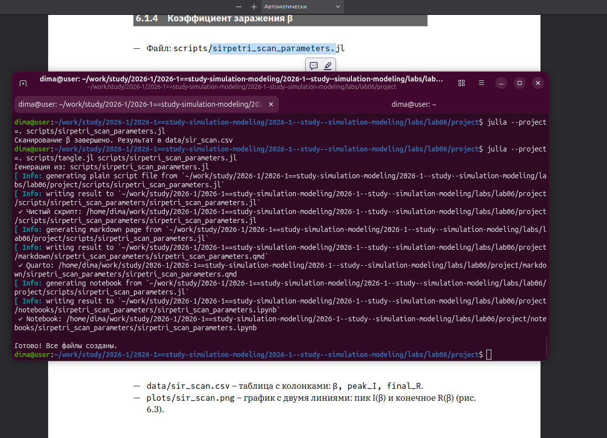{#fig-007 width=70%}

Запускаем скрипт в jupyter notebook. ([рис. @fig-008]).

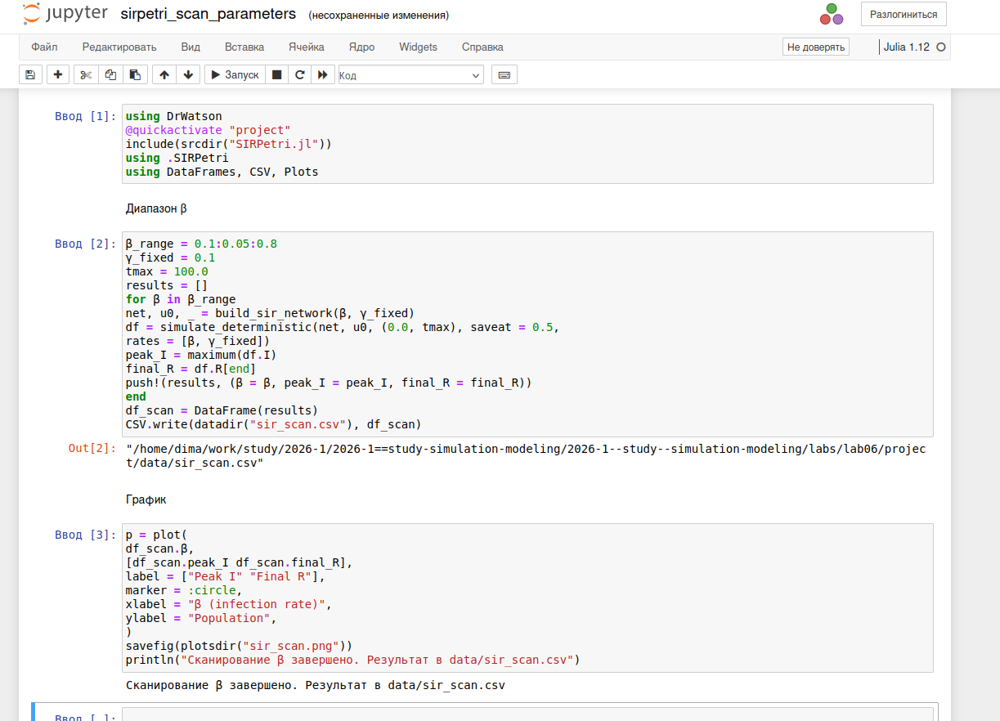{#fig-008 width=70%}

Вот результирующие графики:

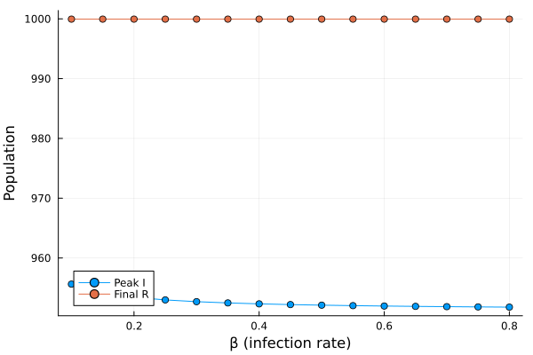{ width=70%}

При малых β (например, 0.1) эпидемия не возникает (peak_I ≈ 0, final_R ≈ 0).
С ростом β пик заболеваемости сначала резко растёт, затем достигает насыщения (почти всё население переболевает).
Конечное R(β) также растёт с β, но медленнее; при больших β практически всё население переходит в R.
Такой график демонстрирует пороговое явление, характерное для модели SIR: существует критическое значение β, выше которого возникает вспышка.

## Анимация детерминированной динамики

Создаем скрипт scripts/sirpetri_animate.jl ([рис. @fig-009]).

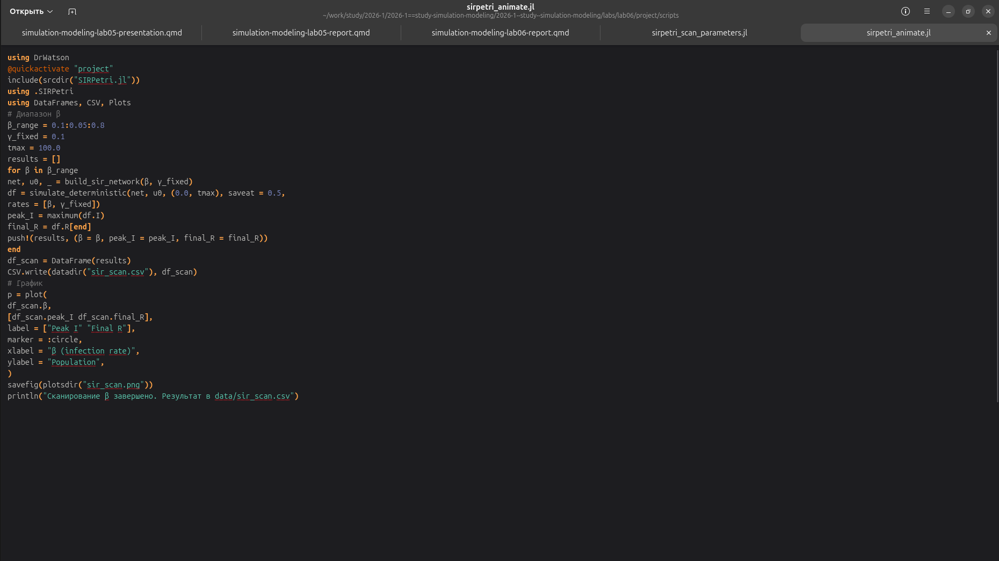{#fig-009 width=70%}

Этот скрипт: 
— Исследуется чувствительность модели к изменению параметра β (скорости заражения).
— Для каждого значения β из диапазона 0.1:0.05:0.8 запускается детерминированная симуляция (γ = 0.1 фиксирован).
— Для каждого прогона вычисляются:
— максимальное число инфицированных (пик эпидемии) – peak_I;
— конечное число выздоровевших – final_R.
— Результаты сводятся в таблицу и строится график зависимости peak_I(β) и final_R(β).

Запускаем скрипт и создаем производные файлы. ([рис. @fig-010]).

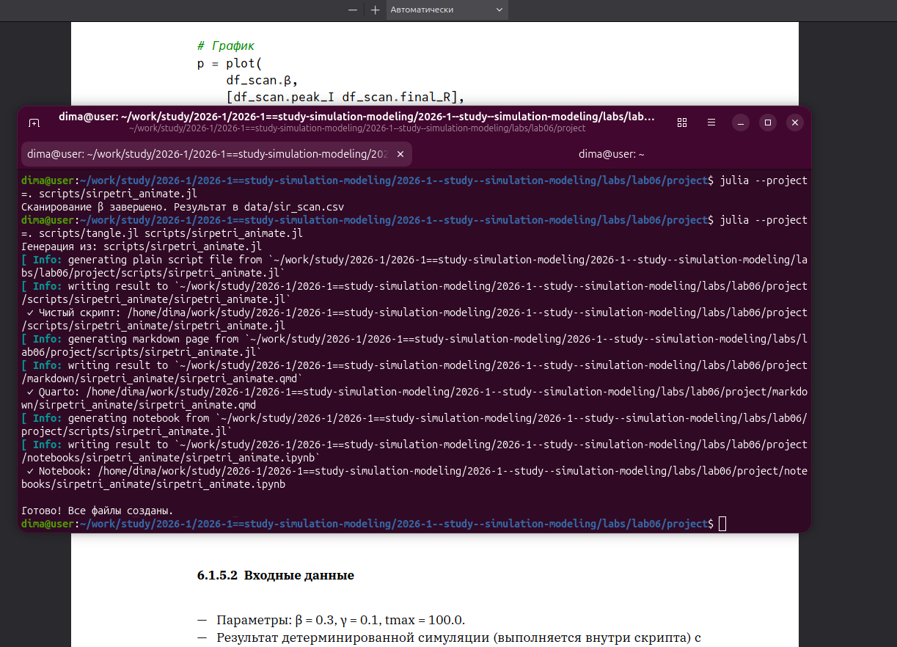{#fig-010 width=70%}

Запускаем скрипт в jupyter notebook. ([рис. @fig-011]).

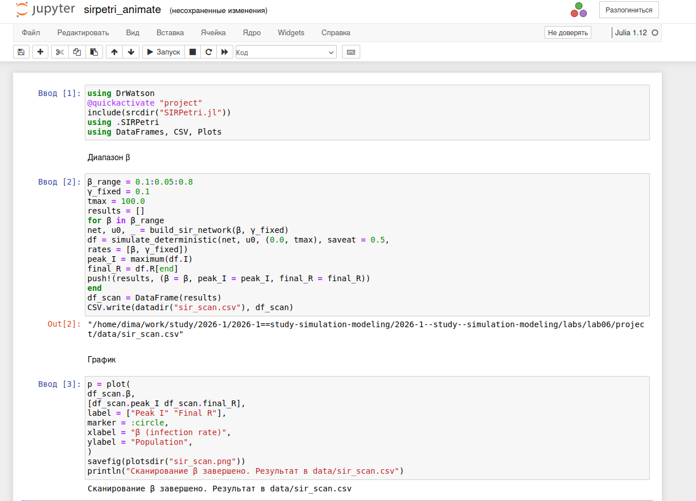{#fig-011 width=70%}

Просмотрим результирующий gif-файл.

На первых кадрах I растёт, S падает.
В момент пика I достигает максимума, затем снижается, а R растёт.
Анимация даёт динамическое представление о том, как волна инфекции проходит через популяцию.

## Итоговый отчёт

Создаем скрипт scripts/sirpetri_report.jl ([рис. @fig-012]).

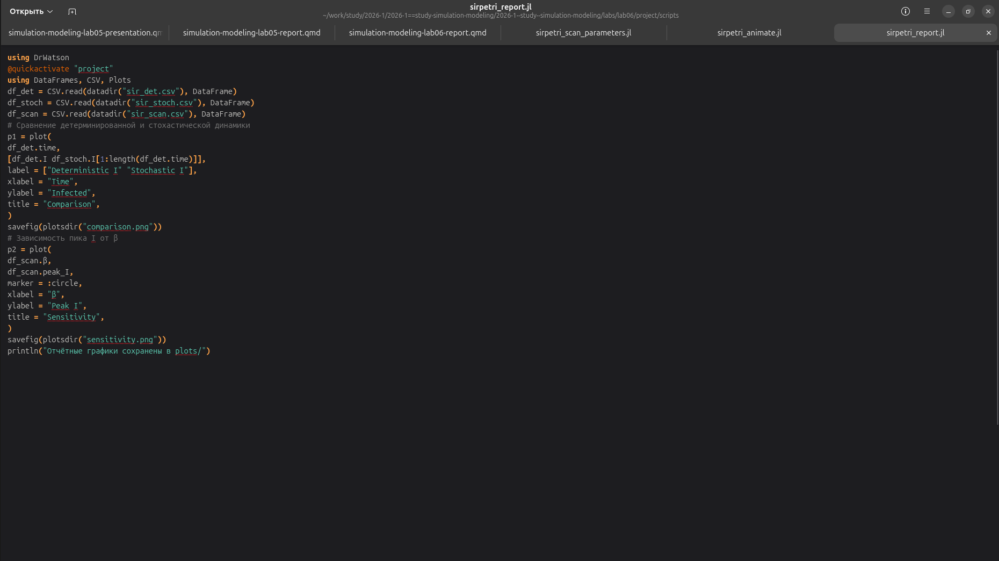{#fig-012 width=70%}

Этот скрипт: 
— Загружает ранее сохранённые результаты (sir_det.csv, sir_stoch.csv, sir_scan.csv) и строит сравнительные графики для итогового отчёта:
— Сравнение детерминированной и стохастической динамики инфицированных I(t).
— Зависимость пика I от β (результат сканирования)



Запускаем скрипт и создаем производные файлы. ([рис. @fig-013]).

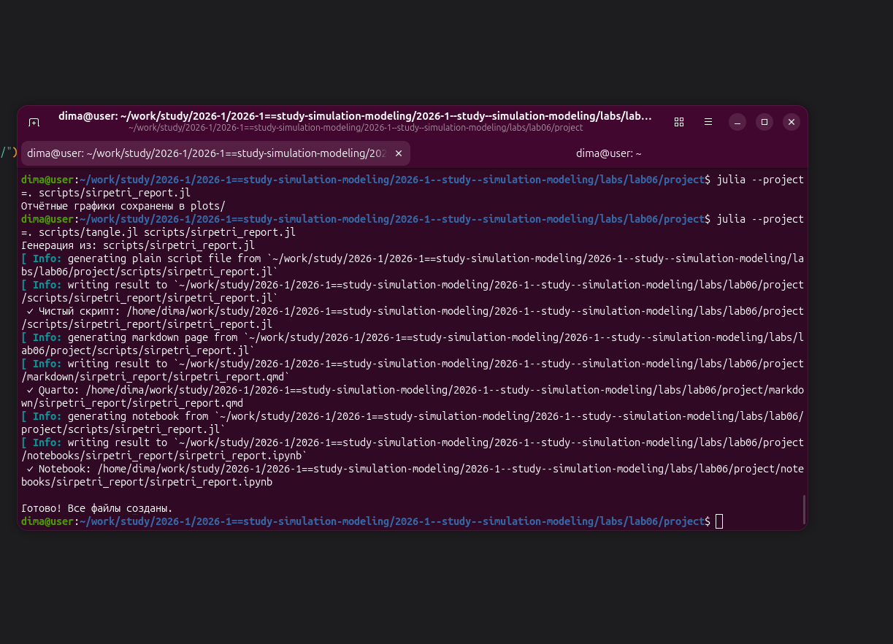{#fig-013 width=70%}

Запускаем скрипт в jupyter notebook. ([рис. @fig-014]).

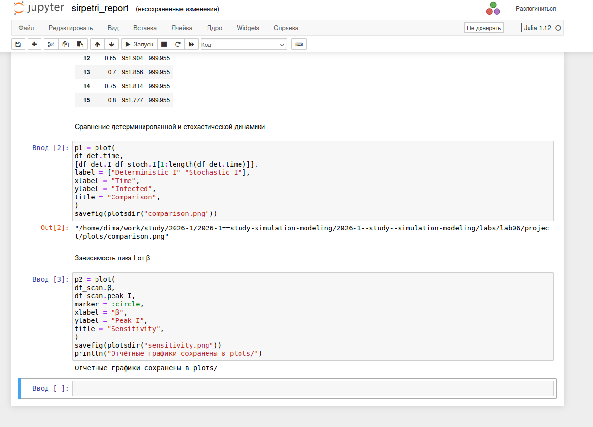{#fig-014 width=70%}

Вот результирующие графики:

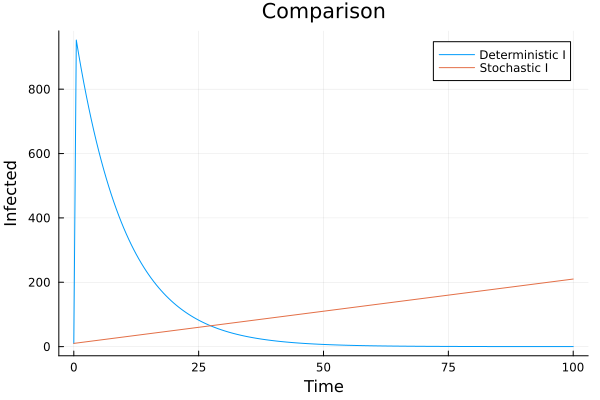{ width=70%}

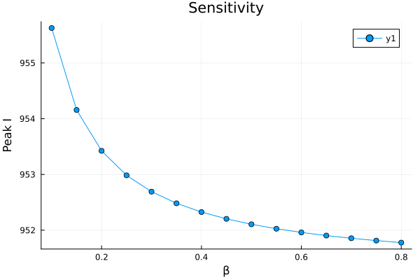{ width=70%}

# Выводы

В ходе данной лабораторной работы мной была реализована модель эпидемии SIR с использованием сетей Петри и проанализирован результат действия данной модели.
