---
## Author
author:
  name: Стрижов Дмитрий Павлович
  email: 1132236054@rudn.ru
  affiliation:
    - name: Российский университет дружбы народов
      country: Российская Федерация
      postal-code: 117198
      city: Москва
      address: ул. Миклухо-Маклая, д. 6

## Title
title: "Отчёт по лабораторной работе №8"
subtitle: "Имитационное моделирование"
license: "CC BY"
---

# Задание

- Создать рабочий каталог для всего курса.
- Установить необходимые пакеты.
- Выполнить предложенный код.
- Преобразовать код в литературный стиль.
- Сгенерировать из литературного кода:
	- чистый код;
	- jupyter notebook;
	- документацию в формате Quarto.
- Выполнить код из jupyter notebook.
- Интегрировать документацию в формате Quarto в отчёт.
- Добавить в код в литературном стиле вычисление для набора параметров.
- Сгенерировать из литературного кода с параметрами:
	- чистый код;
	- jupyter notebook;
	- документацию в формате Quarto.
- Выполнить код из jupyter notebook с параметрами.
- Интегрировать документацию с параметрами в формате Quarto в отчёт.

# Цель работы

Целью данной лабораторной работы является изучить дискретно-событийный подход к имитационному моделированию на примере классической модели распространения инфекции SIR. Реализовать стохастическую дискретно-событийную модель в виде программного комплекса на языке Julia. Провести анализ влияния параметров, сравнить со стохастической и детерминированной версиями, оценить производительность и модифицировать модель.

# Теоретическое введение

В данной работе исследуется распространение инфекционных заболеваний в изолированной популяции с использованием дискретно-событийного подхода (Discrete Event Simulation). В отличие от детерминированных систем дифференциальных уравнений, оперирующих средними величинами, стохастическое агентное моделирование позволяет учесть случайный характер контактов, индивидуальные траектории агентов и флуктуации численности классов.

## Математическая постановка и структура модели

Классическая модель расширяется до структуры **SEIR**, где каждый индивид в процессе своего жизненного цикла последовательно проходит через специфические эпидемиологические состояния, конкурирующие со случайными демографическими событиями:

1. **Susceptible ($S$)** — восприимчивые к инфекции индивиды. Пополняются за счет процесса рождаемости с интенсивностью $\text{birth\_rate}$. При контакте с инфицированным с вероятностью $\beta$ переходят в латентную фазу.
2. **Exposed ($E$)** — латентный (инкубационный) период. Индивиды уже заражены, но еще не способны передавать вирус. Время нахождения в классе распределено стохастически по экспоненциальному закону с параметром скорости перехода $\sigma$.
3. **Infectious ($I$)** — инфицированные (заразные) индивиды, являющиеся источником распространения болезни при контактах, происходящих с частотой $c$.
4. **Recovered ($R$)** — переболевшие индивиды с устойчивым иммунитетом. В этот же класс мгновенно переводится часть пула $S$ при активации механизма вакцинации.
5. **Deceased ($D$)** — умершие индивиды. Переход в это состояние возможен из любого эпидемиологического класса в результате действия фоновой естественной смертности с интенсивностью $\mu_{dem}$.

## Цели и методы исследования

Имитационное моделирование на языке Julia с использованием специализированных библиотек (`ConcurrentSim.jl`, `ResumableFunctions.jl`) позволяет решить следующие задачи:

* **Анализ характера распределений:** исследование влияния природы случайных величин путем сопоставления стохастического времени течения болезни (экспоненциальный закон) и детерминированного фиксированного периода ($1/\gamma$).
* **Анализ чувствительности параметров:** оценка динамики смещения и высоты пика заболеваемости ($\max I(t)$) при вариациях коэффициента трансмиссии $\beta$.
* **Оценка эффективности интервенций:** математическое обоснование стратегий управления эпидемией через симуляцию фазовых сдвигов и изменения объема пула $S$ в моменты проведения вакцинации.

# Выполнение лабораторной работы

Предварительно проверим правильность структуры нашего проекта ([рис. @fig-001]).

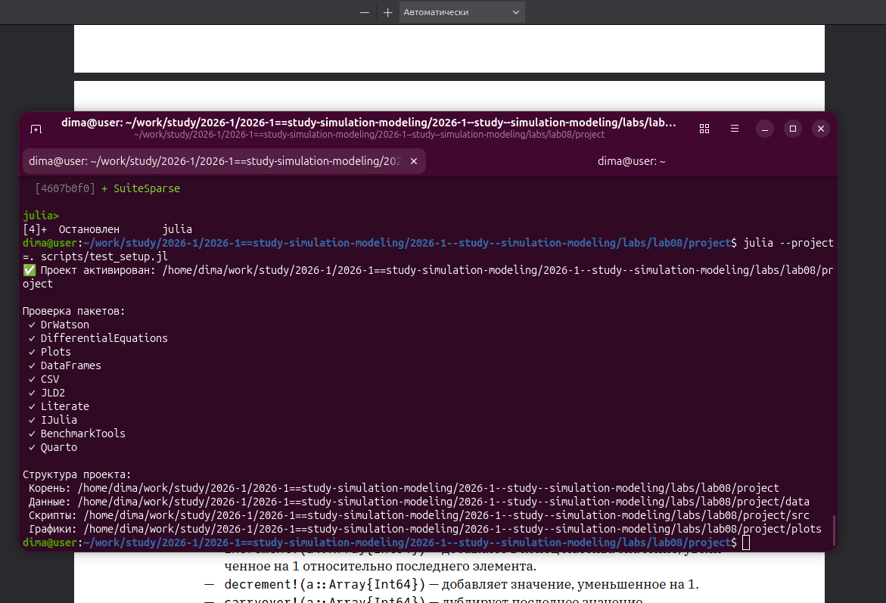{#fig-001 width=70%}

## Программный комплекс

Создадим файл src/sir_model.jl с реализацией вычислительной логики модели ([рис. @fig-002]).

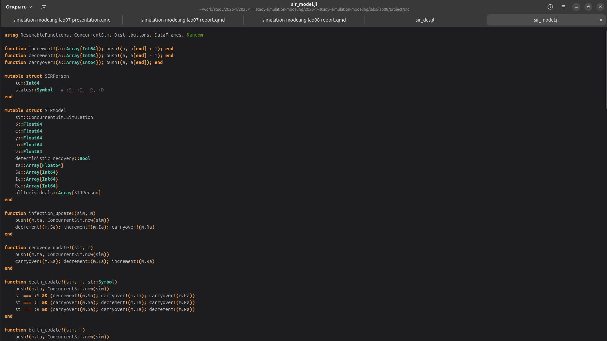{#fig-002 width=70%}

Создадим файл scripts/sir_des.jl. Скрипт запуска - он задаёт параметры, инициализирует модель, выполненяет прогон и визуализацию ([рис. @fig-003]).

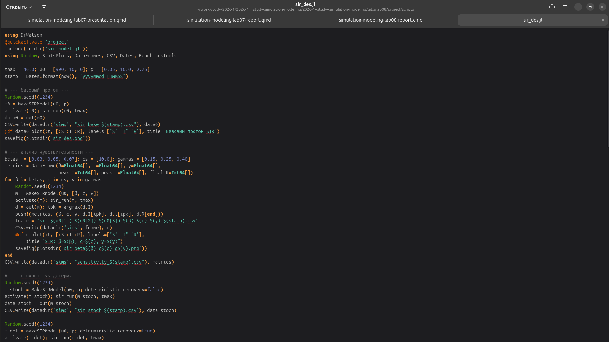{#fig-003 width=70%}



Запустим скрипт. Создадим производные форматы с помощью скрипта tangle.jl ([рис. @fig-004]).

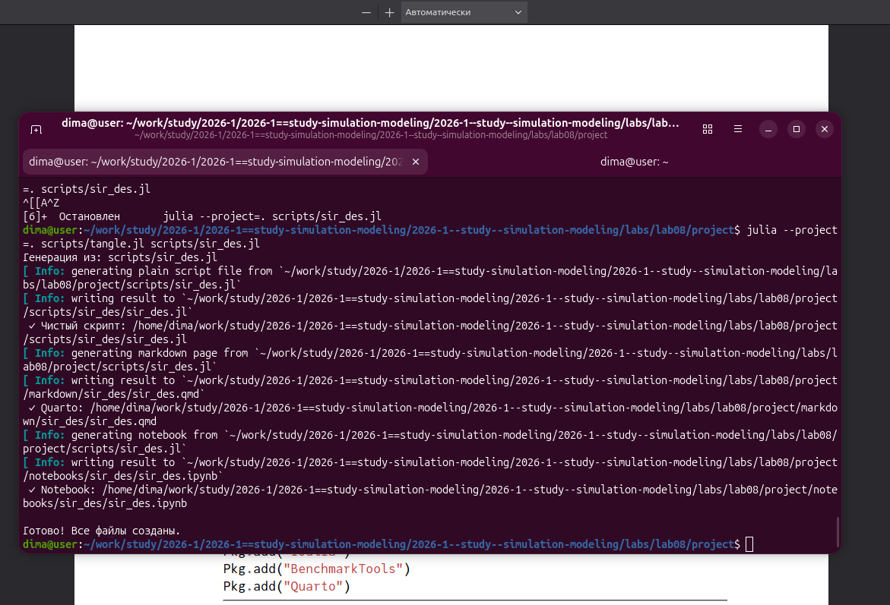{#fig-004 width=70%}

Запустим файл ipynb в jupyter-notebook ([рис. @fig-005]).

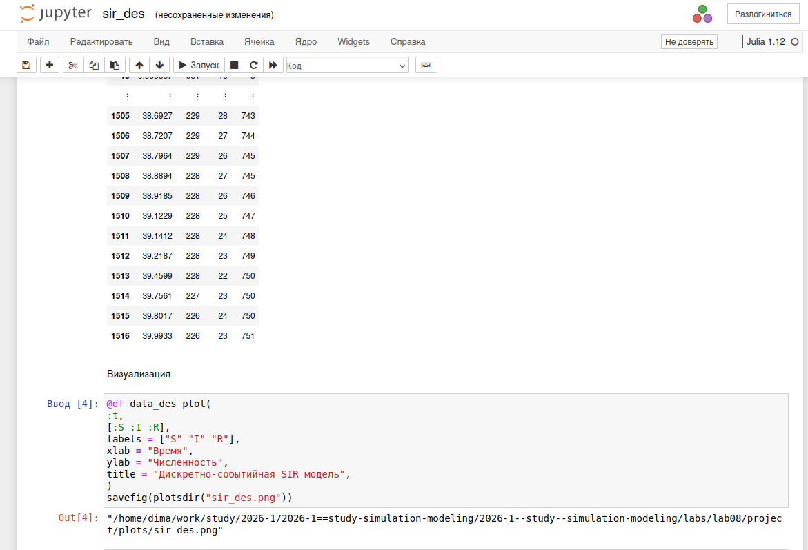{#fig-005 width=70%}

Просмотрим результирующий график ([рис. @fig-006]).

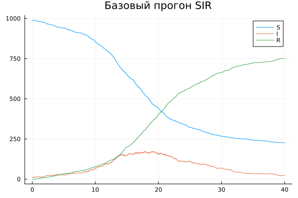{#fig-006 width=70%}

## Дополнительные задания

### Внесение изменений в основной скрипт

Напишем цикл, варьирующий параметры и сохраняющий результат ([рис. @fig-007]).

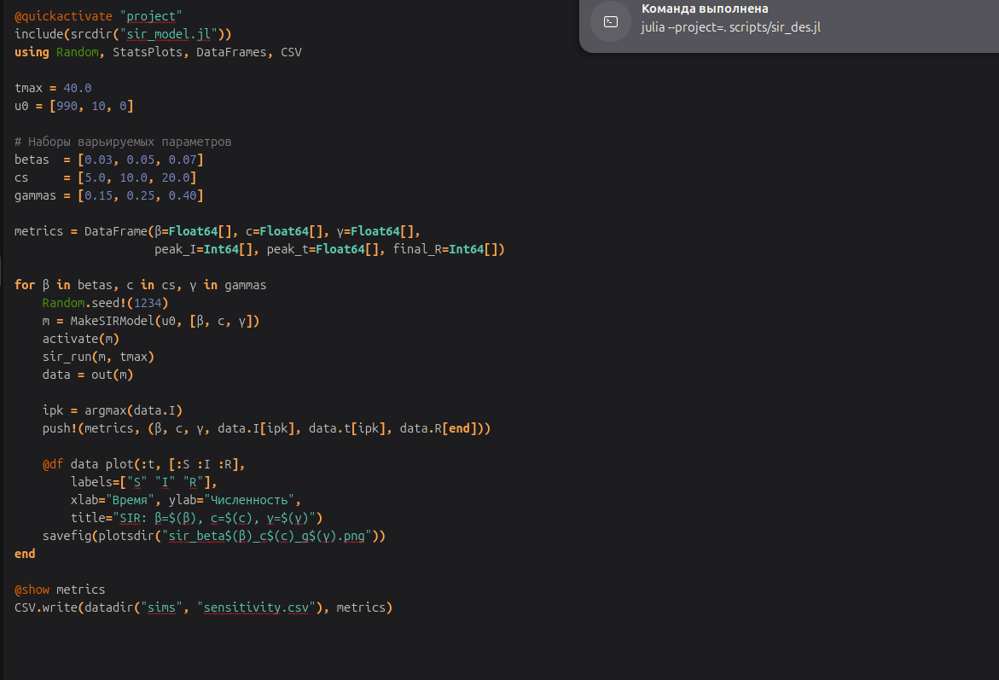{#fig-007 width=70%}

Заменим экспоненциальное время выздоровления на фиксированную величину 1/γ. Сравнить со стохастической версией. Обратим внимание на отсутствие «хвостов» распределения и более синхронное выздоровление ([рис. @fig-008]).

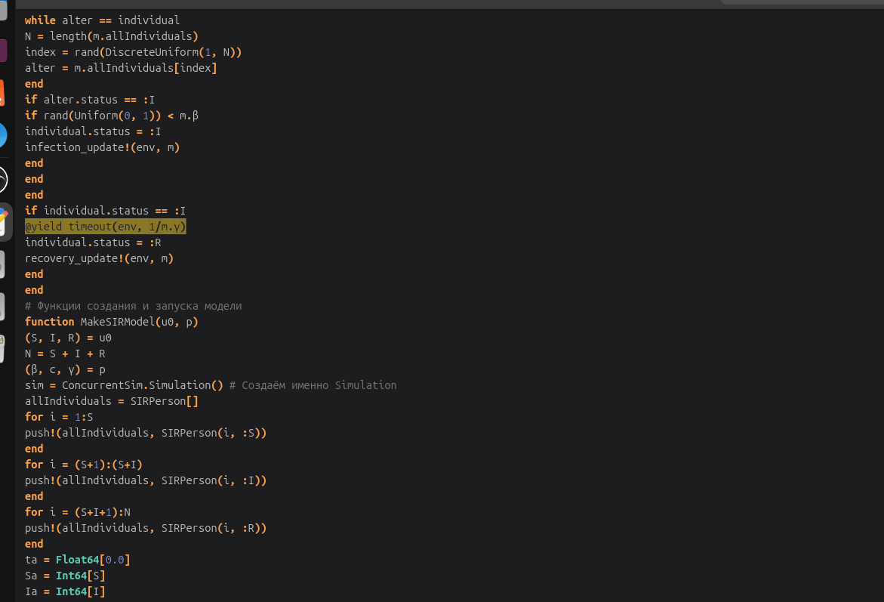{#fig-008 width=70%}

С помощью макроса @benchmark измерим время выполнения sir_run для популяции 10000 индивидов. Предложим способы оптимизации (например, использование векторизованных операций или предварительное генерирование случайных
чисел). ([рис. @fig-009]).

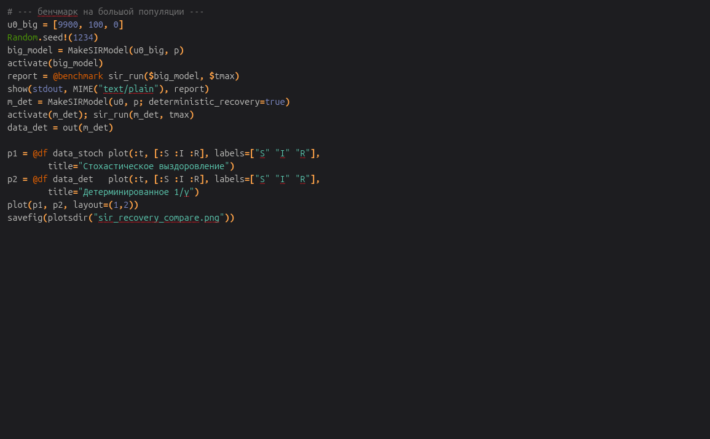{#fig-009 width=70%}

Добавим автоматическое сохранение итоговой таблицы в каталог data/sims/ с уникальным именем, содержащим параметры запуска. ([рис. @fig-010]).

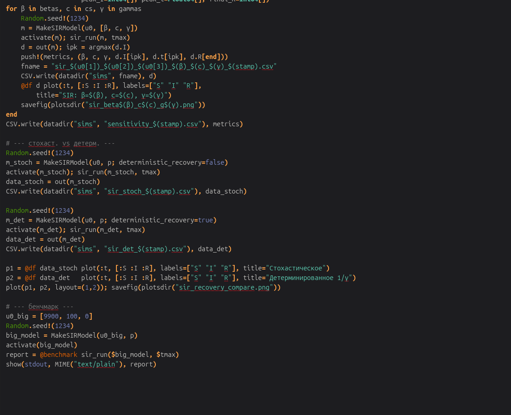{#fig-010 width=70%}

Расширим модель, добавив в жизненный цикл индивида возможность смерти (с постоянной интенсивностью μ) и рождение новых восприимчивых. Смерть удаляет индивида из популяции, рождение добавляет нового в состояние :S. Это позволяет исследовать эндемическое равновесие. ([рис. @fig-011, рис. @fig-012]).

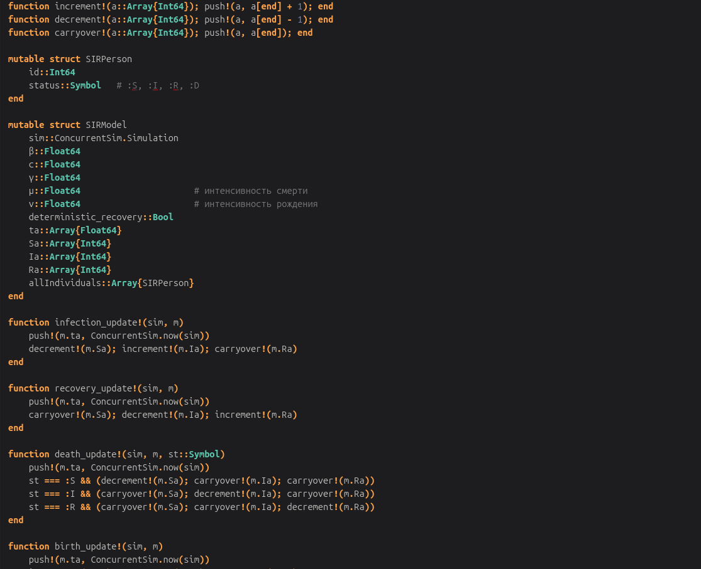{#fig-011 width=70%}

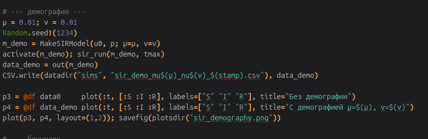{#fig-012 width=70%}

Запустим скрипт и создадим производные файлы ([рис. @fig-013]).

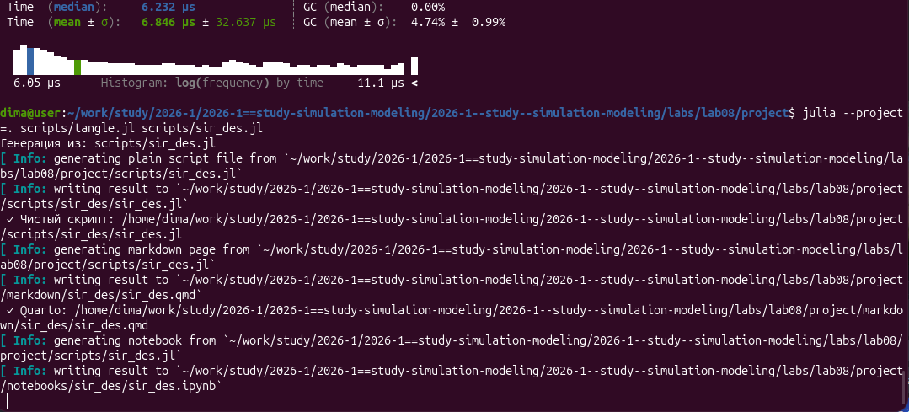{#fig-013 width=70%}

Запустим скрипт в jupyter notebook ([рис. @fig-014]).

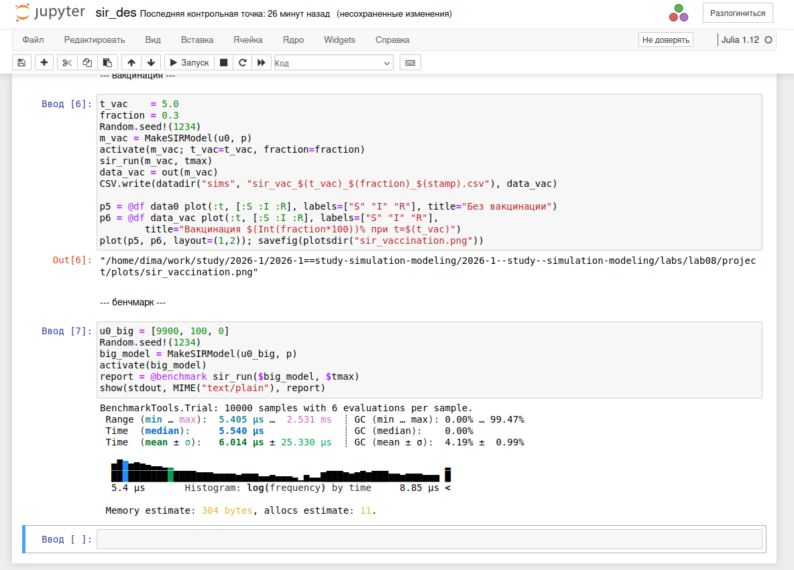{#fig-014 width=70%}

### SEIR

Создадим файлы src/seir_model.jl и scripts/seir_ru.jl ([рис. @fig-015]).

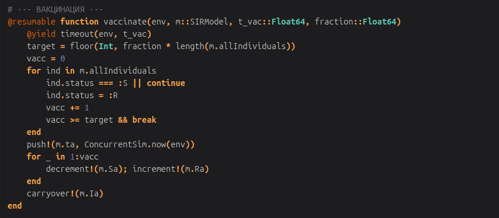{#fig-015 width=70%}



Запустим скрипт и создадим производные файлы ([рис. @fig-015]).

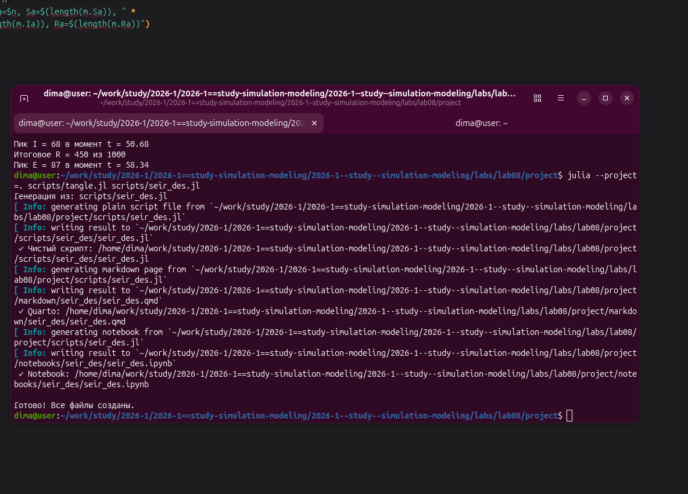{#fig-015 width=70%}

Запустим скрипт в jupyter notebook ([рис. @fig-016]).

{#fig-016 width=70%}

# Выводы

В ходе выполнения данной лабораторной работы мной был изучен дискретно-событийный подход к имитационному моделированию на примере классической модели распространения инфекции SIR. Реализована стохастическую дискретно-событийную модель в виде программного комплекса на языке Julia и проведён анализ влияния параметров, сравнение со стохастической и детерминированной версиями, так же проведена оценка производительности и модифицирована модель.
